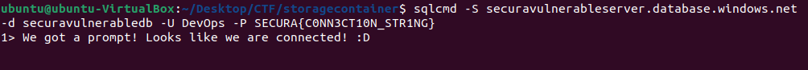

# BrokenByDesign: Azure
- [BrokenByDesign: Azure](#brokenbydesign-azure)
- [What is this CTF?](#what-is-this-ctf)
- [Resources](#resources)
- [Requirements](#requirements)
- [Write-up](#write-up)
  - [Initial access](#initial-access)
  - [Getting access to the Azure Tenant](#getting-access-to-the-azure-tenant)
  - [Lateral movement](#lateral-movement)
  - [Azure portal](#azure-portal)
  - [Dumping a database](#dumping-a-database)
  - [Connecting to the internal network](#connecting-to-the-internal-network)
  - [The final stretch](#the-final-stretch)

# What is this CTF?
This CTF is created and hosted by [Secura](https://www.secura.com/). It was created as a graduation internship by [Siebren Kraak](https://www.linkedin.com/in/siebrenkraak/). It was meant to teach cyber-security enthausiasts about the risks of misconfigurations within Microsoft Azure.

The tool is 100% free to use and is fully open-source. So if you have any cool ideas or find any bugs, feel free add, report or fix them!

- [Link to CTF](https://www.brokenazure.cloud/)
- [CTF architecture source code](https://github.com/SecuraBV/brokenbydesign-azure)
- [CTF website source code](https://github.com/SecuraBV/brokenbydesign-azure-website)

# Resources
- [Blogpost about this CTF](https://www.secura.com/blog/broken-azure-cloud)
- [Newpost about the DEFCON talk](https://www.secura.com/news/secura-at-def-con-2022)

# Requirements
- Software to access an Azure storage container
- Azure CLI
- A tool to connect to an SQL database
- A tool that supports .OVN files to connect to a VPN

# Write-up
I'm not showing the screenshots of me submitting the flags. But you should do that!
## Initial access
When visiting the entry page of the [CTF website](https://www.brokenazure.cloud/) we see the following page:

When looking around on the webpage, we see that the logo of the website is loaded from an external domain. Upon further inspection we notice that the logo is loaded from an Azure storage container `https://supercompanystorage.blob.core.windows.net/storagecontainer/logo.png`.

Because the images is loaded from the storage container, to our webbrowser, we know that this specific resource (or blob) in the storage container is access for anyone (anonymous access). It is quite common that, instead of setting the resourse to 'anonymous access' the administrator of the environment has set the whole container to be anonymously accessible. Let's see if we can connect to the Azure storage container. In this case, I will be using the [Azure Storage Explorer](https://azure.microsoft.com/en-us/products/storage/storage-explorer/) tool by Microsoft. Because the URL we found is a link to a resource, and not to a container, we just remove the name of the resource (`logo.png` in this case) and try to connect to the storage container as an anonymous user.

Success! We have successfully accessed the storage container as an anonymous user. As we can see, we have access to more than just the `logo.png` file. There also seems to be a `.PEM` file and a `.ovpn` file. Let's download both of these files.

## Getting access to the Azure Tenant
Sadly, it seems that for the `.ovpn` file we need access to a username and password. And because we know that this CTF does not have any guessing in it, there is no point in trying to bruteforce this. Let's research what we can do with the `.PEM` file.

After doing some research and looking around in the `.PEM` file, it seems that this file contains a key plus some information about an Azure tenant and an application id. Using this information, we might be able to login using the Azure CLI.

Success! We have succesfully logged in to the Azure tenant as an application! It looks like we do not have a subscription on this machine. Let's look around what a default user can do in Azure.

## Lateral movement
It seems like this application is part of the Azure Active Directory (AAD). This means that we can do some basic enumeration on the AAD, maybe that way we can get some more information.

It looks like one of the DevOps accounts has recently be reset to have a temporarly password. This password has been stored in the notes of the user, so DevOps can access it easily and it was not sent via mail. Apparently the Administrator was not aware that anyone in the Active Directory is able to view this information. Let's see if this password is still correct and if we can use it on the Azure portal.

Success! It looks like the credentials have not been changed and we can access the DevOps user account using the portal. 

## Azure portal
Now that we have access to the Azure portal, we have access to everything that the DevOps user has access to. After checking our privileges it looks like we have read access on most stuff

Luckily for us, read access is also alot of access and we have access to a LOT of resources.

After looking around we found there are some VMs and networks. Sadly, all of these do not seem to have any public IP addresses and ports exposed, so we are unable to make use of this. But another resource that we can access is an Azure function. These Functions are serverless functions that can run on-demand on the Azure servers. Let's check this function out.
 

The name of the function seems to be `GetDbConnection`. This might be a very useful Function. Sadly, we cannot modify this function to make it do stuff for us. Let's see if we can view the source code.

It looks like this Azure function returns a Database connection string! How lucky! Let's see if this database connection string actually works.

Success! We have access to a database!

## Dumping a database
Now that we have access to the database, let's dump all of the information! Because we want to learn stuff, let's not use an automated tool, but let's write the queries ourselfs.

First, lets see if we can view all the tables in the database.

It looks like there is one interesting table named `vpn_employee_data`. Let's write another query to see all the information inside this table.

## Connecting to the internal network
Wow! It looks like this table contains credentials to the VPN! 
As you might recall, we downloaded an Open VPN file from the Azure storage container. The name of this `.ovpn` file seems to match one of the users in the database. Let's see if we can use these credentials to access the VPN.

Success! We are now connected to the VPN. When we were looking around in the Azure portal, we also saw some VMs, networks and other stuff running. But all of these systems did not seem to have a public IP assigned to them. But maybe, now that we are connected to a VPN, we CAN access these systems.

Let's see what our current internal IP address is on the VPN.

And let's check the network that we found on the Azure portal

Yep! It looks like we now have access to the network that did not have any public IP adressess exposed.

## The final stretch
Let's use the tool [NMAP](https://nmap.org/) to scan one of the hosts within this network, to see if it has any services exposed.

It looks like this system has a webserver running. Let's try to access this website while being connected to the VPN. 

We have just found the last flag!

